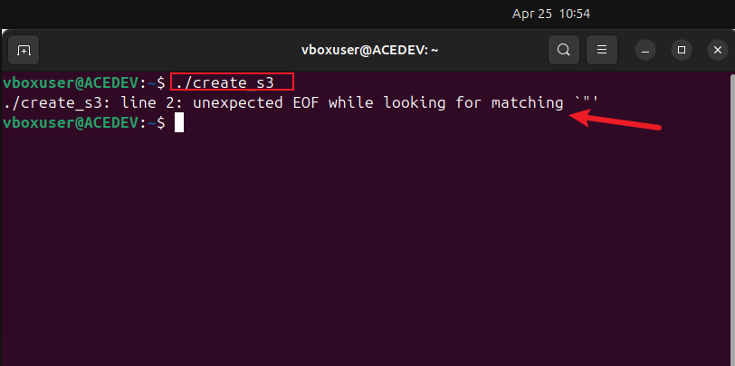

# Error-Handling-in-Shell-Scripting

## Introduction

This project focuses on error handling in shell scripting, an essential technique for creating robust and reliable scripts. The goal is to anticipate and manage errors that might occur due to issues like incorrect user input, resource unavailability, or unexpected system behavior. The script employs conditional statements to identify and respond to errors, providing informative messages to help users resolve issues effectively.

## Handling S3 Bucket Existence Error
To avoid duplication and guarantee seamless operation, the script first determines whether a bucket already exists before attempting to create one.  The project enhances the usefulness and dependability of shell scripts by putting error handling techniques like these into practice.  It also encourages creativity in identifying potential errors and crafting solutions to manage them

## STEP 1 
connecting to aws console on ubuntu
using the command line "aws configure" to input the security credentials and "aws sts get-caller-identity" to check if the connection was susccesful:

writting a shell script to initiate the creation of an s3 bucket
create a new file "create_s3" using nano command and making it executable using "chmod"

contect of the shell script:
        
    #!/bin/bang
    # Function to create S3 buckets for different departments
    create_s3_buckets() {"\n    company=\"datawise\"\n    departments=(\"Marketing\" \"Sales\" \"HR\" \"Operations\" \"Media\")\n    \n    for department in \"${departments[@]"}"; do
        bucket_name="${company}-${department}-Data-Bucket"
        
        # Check if the bucket already exists
        if aws s3api head-bucket --bucket "$bucket_name" &>/dev/null; then
            echo "S3 bucket '$bucket_name' already exists."
        else
            # Create S3 bucket using AWS CLI
            aws s3api create-bucket --bucket "$bucket_name" --region your-region
            if [ $? -eq 0 ]; then
                echo "S3 bucket '$bucket_name' created successfully."
            else
                echo "Failed to create S3 bucket '$bucket_name'."
            fi
        fi
    done
    }

running the shell script i got an error

looking at the error i made adjusment to the following:
* Function declaration syntax: Changed create_s3_buckets() { ... } to standard format.
* Array definition: Used departments=(...) instead of departments=(\"...\").
* Loop syntax: Corrected for department in "${departments[@]}".
* Lowercasing bucket names: S3 bucket names must be lowercase, hence company,, and department,,.
* Region specification: Included --create-bucket-configuration when using regions other than us-east-1.

      #!/bin/bash

      # Set the AWS profile for authentication
      export AWS_PROFILE=default

      # Environment variables
      ENVIRONMENT=$1

      # Function to check the number of arguments
      check_num_of_args() {
      if [ "$#" -ne 1 ]; then
        echo "Usage: $0 <environment>"
        exit 1
      fi
      }
      # Function to activate the infrastructure environment
      activate_infra_environment() {
      if [ "$ENVIRONMENT" == "local" ]; then
        echo "Running script for Local Environment..."
      elif [ "$ENVIRONMENT" == "testing" ]; then
        echo "Running script for Testing Environment..."
      elif [ "$ENVIRONMENT" == "production" ]; then
        echo "Running script for Production Environment..."
      else
        echo "Invalid environment specified. Please use 'local', 'testing', or 'production'."
        exit 2
      fi                                                                                                                                            }
      create_s3_buckets() {
      company="datawise"
      departments=("Marketing" "Sales" "HR" "Operations" "Media")

      for department in "${departments[@]}"; do
        bucket_name="${company}-${department}-${ENVIRONMENT}-$(date +'%Y%m%d%H%M%S')"

      # Ensure it's valid
        bucket_name=$(echo "$bucket_name" | sed 's/[^a-z0-9.-]//g' | sed 's/^-//g' | sed 's/-$//g')

        echo "Validated bucket name: $bucket_name"
        echo "Company: $company, Department: $department, Bucket Name: $bucket_name"

        # Attempt to create bucket
        aws s3api create-bucket \
            --bucket "$bucket_name" \
            --region "us-east-1" \

        # Check the result
        if [ $? -eq 0 ]; then
            echo "S3 bucket '$bucket_name' created successfully."
        else
            echo "Failed to create S3 bucket '$bucket_name'. Check debug.log for details."
        fi
      done
      }
      # --- Main Execution ---
      check_num_of_args "$@"
      activate_infra_environment
      create_s3_buckets

afterwhich i run the the updated shell script on local using the "./" which was successful

checking on the aws console we can see the newly created s3 buckets

# Summary
In order to increase shell scripts' dependability and usefulness, you discussed how crucial it is to foresee and control failures.  You gained knowledge about how to spot possible mistake causes, such as inaccurate user input or unavailable resources, and create plans to deal with them.  You created scripts that react dynamically to problems by analyzing command exit statuses and adding conditional statements.  You also showed innovation in building reliable solutions by implementing error handling for particular cases, including determining whether S3 buckets already exist before generating new ones.  Overall, you are now able to write more reliable scripts and confidently tackle scripting issues because to your comprehension of error management.